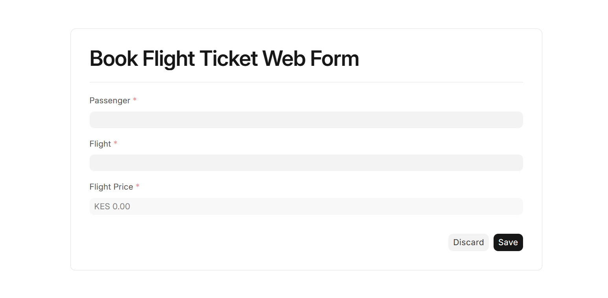
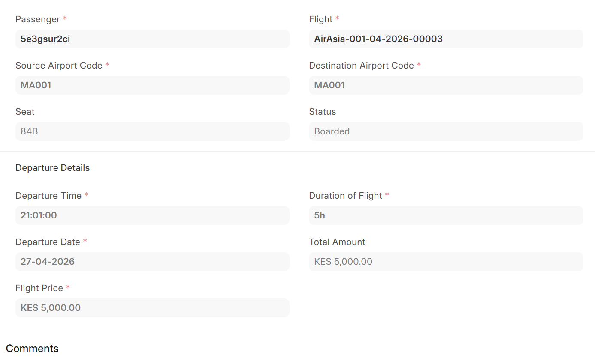

# Airplane Mode

A flight management application built with Frappe Framework for managing airplanes, flights, and airline operations.

## Features

- Manage airplane records
- Store flight details
- Track airline operations
- Generate reports
- Manage flight schedules

## Installation

Clone the repository inside your Frappe bench apps directory:

```bash
cd frappe-bench/apps
git clone https://github.com/Nalish/airplane_mode.git
```

Go back to the bench directory and install the app:

```bash
cd ..
bench install-app airplane_mode
```

Run the server:

```bash
bench start
```

Open in your browser:

http://localhost:8000

## Screenshots

### Airplane Ticket



### Airplane Flight



### Passenger Ticket


